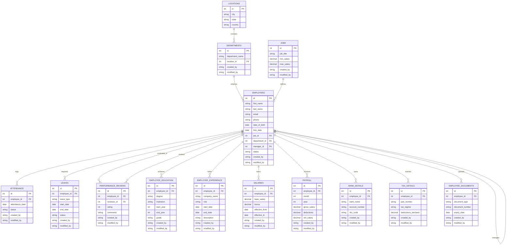

# Check database exists or not
```Bash
psql -U postgres -tc "SELECT 1 FROM pg_database WHERE datname = 'database_name'" | grep -q 1
```

# If not exists than only run below command manually
- Flyway can not create database, so you need to create database manually before running migration commands.
```SQL
CREATE DATABASE emfs
    WITH
    OWNER = postgres
    ENCODING = 'UTF8'; 
```

# Check loaded configuration
./gradlew dbStatus -Penv=local

# Check migration status
./gradlew flywayInfo -Penv=local

# Commands to Run Flyway on Local
- Open your terminal in the project root folder:

## Step A: Verify connection and loaded credentials
```Bash
./gradlew dbStatus -Penv=local
```
(Check that Database User: emfs_admin is printed from your ```bash~/.gradle/gradle.properties```)

## Step B: Check current migration status (Dry-run / Info)
```Bash
./gradlew flywayInfo -Penv=local
```

## Step C: Execute all pending migrations
```Bash
./gradlew flywayMigrate -Penv=local
```

## Step D: Validate applied scripts against database state
```Bash
./gradlew flywayValidate -Penv=local
```
# ER Diagram

